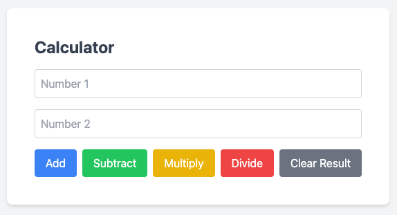

# Calculator Microservice

[](https://github.com/MaxAnderson95/calculator-microservice/actions/workflows/build.yaml)

## Architecture Diagram


## Services

### Frontend

A Python FastAPI service which serves the static content at `/` and a user API at `/api/v1`.



The web UI is written using HTMX, Tailwind CSS, and some basic JS. It submits the values in the form to the `/api/v1/calculate` route. The values are submitted and encoded as form data. The keys in the form are `operation`, `num1`, and `num2`. Valid values for `operation` are `add`, `subtract`, `multiply`, and `divide`.

### Add Service

A Python FastAPI service which serves a single route: `/api/v1/add`. It accepts a traditional JSON payload in the following format:

```json
{
    "num1": float,
    "num2": float
}
```

It then returns a response in the following format:

```json
{
    "result": float
}
```

The logic for addition is contained inside this service.

### Subtract Service

A Python FastAPI service which serves a single route: `/api/v1/subtract`. It accepts a traditional JSON payload in the following format:

```json
{
    "num1": float,
    "num2": float
}
```

It then returns a response in the following format:

```json
{
    "result": float
}
```

This service farms its logic off to the addition service buy converting `num2` to a negative number, and then sending it for addition.

### Multiply Service

A Python FastAPI service which serves a single route: `/api/v1/multiply`. It accepts a traditional JSON payload in the following format:

```json
{
    "num1": float,
    "num2": float
}
```

It then returns a response in the following format:

```json
{
    "result": float
}
```

The logic for multiplication is contained inside this service.

### Divide Service

A Python FastAPI service which serves a single route: `/api/v1/divide`. It accepts a traditional JSON payload in the following format:

```json
{
    "num1": float,
    "num2": float
}
```

It then returns a response in the following format:

```json
{
    "result": float
}
```

The logic for division is contained inside this service.
