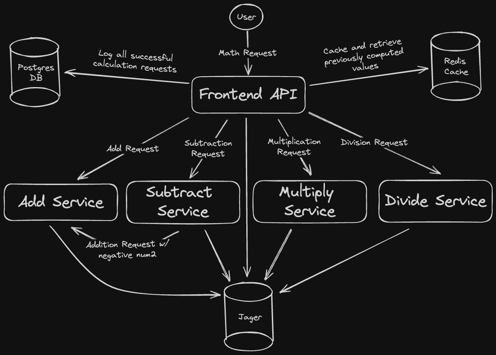

# Calculator Microservice

[](https://github.com/MaxAnderson95/calculator-microservice/actions/workflows/build.yaml)

A distributed calculator service written in Python.


## Services

| Service  | Purpose                                          | Notes                                                                                                                                         |
| -------- | ------------------------------------------------ | --------------------------------------------------------------------------------------------------------------------------------------------- |
| frontend | Frontend UI written in HTMX + business logic API | Calls the other services for calculation services.                                                                                            |
| add      | Dddition services                                |                                                                                                                                               |
| subtract | Subtraction services                             | Calls the add service with the 2nd number as a negative                                                                                       |
| multiply | Multiplication services                          |                                                                                                                                               |
| divide   | Division services                                |                                                                                                                                               |
| redis    | Caching                                          | caches already computed computations. Each math service introduces an artifical delay of 2 seconds so the speed from caching can be observed. |
| postgres | Request logging                                  | Logs all sucessful computation requests. Optional. If not specified, a local SQLite DB is used.                                               |

## Architecture Diagram



## Run locally

To run locally, the easiest way is Docker compose. Simply run:

```
docker-compose up
```

Then access the frontend on `http://localhost:8000`.

## Todo List

- [x] Build a basic two tier service architecture

- [x] Build a frontend web UI

- [x] Add Redis caching to the frontend to cache recently computed calculations. Add delays to all calls by default to see the difference on a cache hit.

- [x] Add a Postgres database to store a log of all calculation queries.

- [ ] Instrument each service with OpenTelemetry to allow for exporting of trace data.

- [ ] Add Prometheus (OpenMetrics) endpoints to export various metrics for each service.

- [ ] Add a "chaos" switch which enables purposeful bugs, errors, and delays in various functions.

- [ ] Add an artifical load-generator service that sends calls to the frontend to simulate usage while monitoring metrics and traces.
